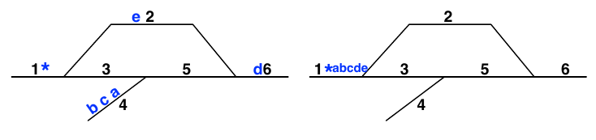
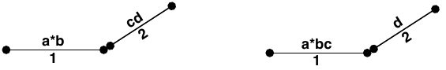
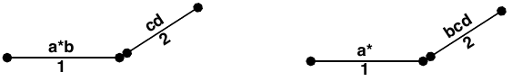
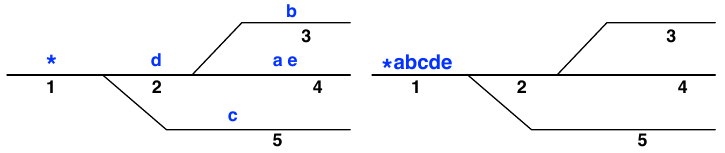

# CISC481 Programming Assignment 1 Writeup

This is the writeup for my submission of Programming Assignment 1 in CISC481
\- Artificial Intelligence.

Included is the original [assignment description](#assignment-description),
my [findings](#findings) after completing all parts of this assignment, and a
[sample output](#sample-output) of my completed program.

## Assignment Description

Below is the full assignment description rendered identically to the original
PDF and rewritten in markdown for viewing on GitHub.

This assignment was created by
[Greg Silber](https://www.cis.udel.edu/people/faculty/greg-silber/), associate
instructor for the Department of Computer and Information Sciences at the
University of Delaware.

### Programming Assignment 1

**_[Goals: Basic blind/heuristic search techniques]_**

_[Warning: For some students, these assignments can take longer than you
anticipate, so START EARLY. Potential trouble areas include your choice of
representation for states and nodes; your unfamiliarity with actually writing
the search algorithms discussed in class (remember there is pseudocode in the
textbook); issues with memory and processing time when working with truly large,
NP-hard problems.]_

#### The Switch Problem

Consider the problem of maneuvering railroad cars in a train yard. Many cars
must be assembled into a train of cars in a given order, but the cars start out
dispersed throughout the yard, and can only move in prescribed ways on existing
track. Below is an example of a small train yard with suf cient connectivity to
arrange railroad cars into any desired sequence. The different sections of track
have been numbered from 1 to 6. The gure also shows the starting position for a
small train, where each car is represented by a lowercase letter, and the engine
is represented by an asterisk “\*”. Finally, we show the same cars in the goal
position, with the cars lined up in order for a departure to the west.



#### Representing The Problem

##### Yard

We can represent train **Yard** as a connectivity list. The simple nature of
train yards used in this assignment allows us to describe the yard as a list of
right and left edges connected by vertices (in the real world, such vertices are
called "switches"). Thus, because the right edge of track 1 connects to the left
edges of tracks 2 and 3, we find the sublists (1 2) and (1 3) included on our
yard vertex list.

_[My examples here are in Lisp/Scheme/Racket/BSL, but feel free to use something
similar that’s easy to parse in your target language.]_

```lisp
(define YARD-1 '((1 2) (1 3) (3 5) (4 5) (2 6) (5 6)))
```

##### State

A **State** can be represented as a list of the cars on each section of the
track in their respective orders. The rst element is (\*), indicating only the
engine is on track 1, and the sixth element is (d) because only car d is on
track 6. Note that when there's more than one car on a track, they are listed
left-to-right (b is on the left end of track 4).

```lisp
(define INIT-STATE-1 '((*) (e) empty (b c a) empty (d)))
(define GOAL-STATE-1 '((* a b c d e) empty empty empty empty empty))
```

##### Action

The following two rules describe an **Action** in the train yard. No other
actions are allowed; cars cannot move without using the engine, jump over other
cars, or teleport from one track to another.

Each rule is of the following format: `(DIRECTION FROM-TRACK TO-TRACK)`

###### (LEFT y x)

If the connectivity list contains a sublist (x y) **_and either track x or track
y contains the engine,_** then the rst car of track y can be removed from track
y and placed at the end of track x. We call this a **"LEFT"** move; so if (1 2)
is on the connectivity list, we can move from state ((\*)(e)) to state ((\*e)
empty), or from state ((a\*b) (cd)) to state ((a\*bc)(d)). We will notate this
below as **"(LEFT y x)"** — _note the transposition of y and x_ — meaning move
one car **from** the left end of track **y** leftward **to** the (right) end of
track **x.**



(LEFT 2 1): Move leftmost car FROM track 2 LEFTward TO become the rightmost car
on track 1; “move one car LEFT from track 2 to track 1”

###### (RIGHT x y)

If the connectivity list contains the sublist (x y) **_and either track x or
track y contains the engine,_** then the last car of track x an be removed from
track x and placed at the front of track y. We call this a **"RIGHT"** move; so
if (1 2) is on the connectivity list, then a legal move from ((\*)(e)) is to
(empty (\*e)), and a legal move from state ((a\*b)(cd)) is to ((a\*)(bcd)).
**_Note that only one symbol moves each time (the engine must have pushed car b
right and then returned to track 1)._** We will notate this as **"(RIGHT x y)"**
below, meaning move one car **from** (the right end of) track **x** rightward
**to** (the left end of) track **y.**



(RIGHT 1 2): Move rightmost car FROM track 1 RIGHTward TO become leftmost car on
track 2; “move one car RIGHT from track 1 to track 2”

#### Problem 1

Write a function `possible-actions` that consumes a `Yard` (connectivity list)
and a `State`, and produces a list of all actions possible in the given train
yard from the given state. Run your function on at least three different yards
and two different states for each yard, including the two large yards and
initial states described pictorially in this handout. _[This is the **actions**
function we discussed in class and in the book.]_

_Hint: Recall that all possible actions must be from or to a track with the
engine._

#### Problem 2

Write a function `result` that consumes an `Action` and a `State` and produces
the new `State` that will **result** after actually carrying out the input move
in the input state. Be certain that you do NOT accidentally modify the input
state variable! Also, I've never seen a "clever" solution to this, you just have
to do it by cases. It's ugly! Sorry! _[This is the **result** function we
discussed in class; the state transition model]._

```lisp
(check-expect (apply-move '(left 2 1) INIT-STATE-1)
              '((* e) empty empty (b c a) empty (d)))
(check-expect (apply-move '(right 1 2) INIT-STATE-1)
              '(empty (* e) empty (b c a) empty (d)))
```

#### Problem 3

Write function `expand` that consumes a `State` and a `Yard`, and produces a
list of all states that can be reached in one `Action` from the given state.
_[This is a trivial extension of Problems 1 and 2.]_

```lisp
(check-expect (expand INIT-STATE-1 YARD-1)
              (list '(empty (* e) empty (b c a) empty (d))
                    '(empty (e) (*) (b c a) empty (d))
                    '((* e) empty empty (b c a) empty (d))))
```

#### Problem 4

Write a program that consumes a connectivity list (`Yard`), an initial `State`,
and a goal `State` as inputs, and produces a list of Actions that will take the
cars in the initial state into the goal state.

**Use a blind tree search method.** Briefly justify your choice (including a
discussion of optimality). Remember that you will need to develop a **_node_**
structure for the tree search, for which the state is only one component.

Test your program on the following problem, YARD-2:



_NOTE: You should of course try the little tiny yards, yards 3–5, listed at the
bottom of this assignment, before trying yard-2. Do **NOT** try to do yard-1
with blind search!_

#### Problem 5

How big is the search space for c cars on t tracks? i.e. how many possible
states?

#### Problem 6

Now describe at least one **heuristic**. Argue why it is **admissible.** Write a
new search program to do a heuristic tree search using an algorithm of your
choice (choose carefully; you should aim for an optimal solution). Run your
program again on the same yards. You should expect a speedup of at least 2 or 3
times. You might not be able to solve yard-1 at all unless your heuristic is
very good or you are very ef cient.

Prepare a short write-up comparing the **runtime** and the **number of nodes
expanded** for yards 1–5, for both the uninformed and informed search you chose.

#### Problem 7

Implement a heuristic **graph** search version of Problem 6. Add it to the
writeup: how does it compare on runtime and number of nodes expanded?

#### Notes

These problems are “hard” computationally. Make sure your code works on simple
train yards rst. Use extensive Unit Testing on your possible-actions and result
functions. Here's three simpler problems to test code on before trying a hard
problem. Don't try to solve YARD-1 or YARD-2 unless you can solve these trivial
yards first!

```lisp
(define YARD-3 '((1 2) (1 3)))
(define INIT-STATE-3 '((*) (a) (b)))
(define GOAL-STATE-3 '((* a b) empty empty))

(define YARD-4 '((1 2) (1 3) (1 4)))
(define INIT-STATE-4 '((*) (a) (b c) (d)))
(define GOAL-STATE-4 '((* a b c d) empty empty empty))

(define YARD-5 '((1 2) (1 3) (1 4)))
(define INIT-STATE-5 '((*) (a) (c b) (d))) ;Note c and b out of order
(define GOAL-STATE-5 '((* a b c d) empty empty empty))
```

**Comment your code appropriately. That's part of your grade here.**

Your code should run on similar inputs other than the 5 shown here! Make sure
you indicate how to run your code on other yards for the TA.

## Findings

Below are my observations after completing this assignment.

### Search Space Calculation

Answer for [problem 5](#problem-5):

> The search space for $c$ cars on $t$ tracks can be equated with this formula:
>
> $$
> \frac{(c+t-1)!}{(t-1)!}
> $$
>
> For example, on YARD-1, let $c=6,\ t=6$,
>
> $$
> \frac{(6+6-1)!}{(6-1)!} = \frac{11!}{5!} = 332,640
> $$
>
> So, the search space on YARD-1 is 332,640 possible states.

### Heuristic Admissibility

Answer for [problem 6](#problem-6):

> The heuristic I wrote is admissible because it represents the minimum amount
> of actions needed to solve the yard without overestimating the cost. It
> identifies the deepest misplaced car on a track and calculates the cost to
> move that car and everything shunted in front of it, as the cars in front must
> be cleared before the foundation can be corrected. Since each of these cars
> must take at least one move to reach the goal, the heuristic provides a
> guaranteed lower bound of the true remaining cost.

### A\* Algorithm Tests

Answer for [problem 6](#problem-6):

> A\* demonstrates that combining a deeply informed heuristic with graph memory
> is the most efficient approach. By storing reached states, it prunes 90% of
> the Yard 1 search space, solving it in just 35,577 nodes and finding the
> optimal 22-action path in roughly one second.

### Simulated Annealing Tests

Answer for [problem 7](#problem-7):

> Simulated Annealing functions as a stochastic explorer that prioritizes low
> memory usage over path optimality. Because it makes randomized moves based on
> temperature, it often produces thousands of redundant actions, like the 62,094
> moves in Yard 1. It requires "re-heating" strategies to escape local optimal
> that deterministic algorithms like A\* avoid entirely.

## Sample Output

Here's the output after running my program with all tests enabled.

```text
$ python main.py

Starting tests...

Running tests for blind_tree_search (uninformed)

Yard 1: Skipping due to memory limits
Yard 2: Skipping due to memory limits
Yard 3: 00.000161s | Node count: 7
        (LEFT  2 1)
        (LEFT  3 1)
Yard 4: 00.004054s | Node count: 155
        (LEFT  2 1)
        (LEFT  3 1)
        (LEFT  3 1)
        (LEFT  4 1)
Yard 5: 00.102141s | Node count: 2,698
        (LEFT  2 1)
        (LEFT  3 1)
        (RIGHT 1 2)
        (LEFT  3 1)
        (LEFT  2 1)
        (LEFT  4 1)

Running tests for a_star_search (uninformed)

Yard 1: Skipping due to memory limits
Yard 2: 06.482420s | Node count: 132,765
        (LEFT  2 1)
        (RIGHT 1 5)
        (RIGHT 1 2)
        (LEFT  4 2)
        (LEFT  3 2)
        (LEFT  4 2)
        (LEFT  2 1)
        (LEFT  2 1)
        (LEFT  2 1)
        (LEFT  5 1)
        (RIGHT 1 2)
        (LEFT  5 1)
        (LEFT  2 1)
        (LEFT  2 1)
Yard 3: 00.000159s | Node count: 3
        (LEFT  2 1)
        (LEFT  3 1)
Yard 4: 00.000203s | Node count: 5
        (LEFT  2 1)
        (LEFT  3 1)
        (LEFT  3 1)
        (LEFT  4 1)
Yard 5: 00.002257s | Node count: 52
        (LEFT  2 1)
        (LEFT  3 1)
        (RIGHT 1 2)
        (LEFT  3 1)
        (LEFT  2 1)
        (LEFT  4 1)

Running tests for a_star_search (informed)

Yard 1: 01.079758s | Node count: 35,577
        (RIGHT 1 2)
        (RIGHT 2 6)
        (RIGHT 2 6)
        (LEFT  6 5)
        (RIGHT 4 5)
        (LEFT  5 3)
        (RIGHT 4 5)
        (RIGHT 4 5)
        (LEFT  5 3)
        (LEFT  5 3)
        (RIGHT 5 6)
        (LEFT  6 2)
        (LEFT  6 2)
        (LEFT  6 2)
        (LEFT  2 1)
        (LEFT  3 1)
        (LEFT  3 1)
        (LEFT  3 1)
        (LEFT  2 1)
        (RIGHT 1 3)
        (LEFT  2 1)
        (LEFT  3 1)
Yard 2: 00.074594s | Node count: 2,617
        (LEFT  2 1)
        (RIGHT 1 5)
        (RIGHT 1 2)
        (LEFT  4 2)
        (LEFT  3 2)
        (LEFT  4 2)
        (LEFT  2 1)
        (LEFT  2 1)
        (LEFT  2 1)
        (LEFT  5 1)
        (RIGHT 1 2)
        (LEFT  5 1)
        (LEFT  2 1)
        (LEFT  2 1)
Yard 3: 00.000102s | Node count: 3
        (LEFT  2 1)
        (LEFT  3 1)
Yard 4: 00.000155s | Node count: 5
        (LEFT  2 1)
        (LEFT  3 1)
        (LEFT  3 1)
        (LEFT  4 1)
Yard 5: 00.000946s | Node count: 31
        (LEFT  2 1)
        (LEFT  3 1)
        (RIGHT 1 2)
        (LEFT  3 1)
        (LEFT  2 1)
        (LEFT  4 1)

Running tests for simulated_annealing_search (uninformed)

Yard 1: 01.779682s | Node count: 78,287   | Action count: 62,094
Yard 2: 00.415754s | Node count: 19,795   | Action count: 19,604
Yard 3: 00.000135s | Node count: 5        | Action count: 4
Yard 4: 00.032626s | Node count: 1,405    | Action count: 1,402
Yard 5: 00.111153s | Node count: 5,101    | Action count: 5,098

Tests complete.
```
